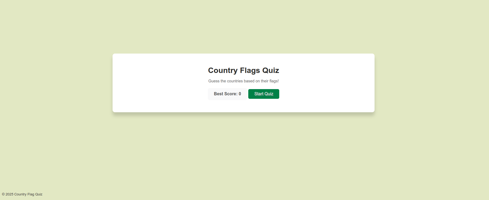
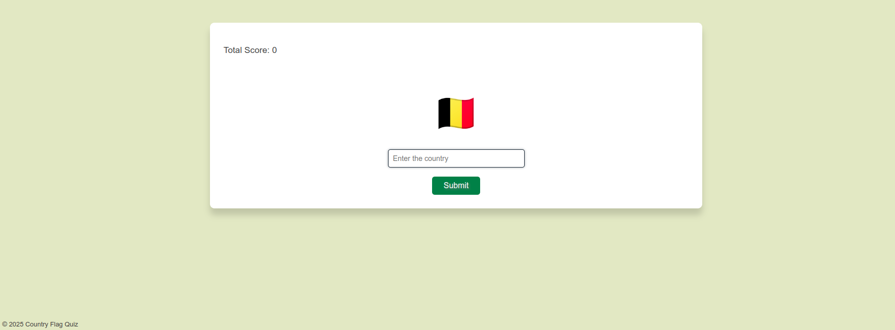

# County-Flag-Quiz
## Overview

The County Flag Quiz is a web application designed to test your knowledge of country flags. It presents you with a flag and challenges you to guess the corresponding country. Keep track of your best score and see how many flags you can recognize!





## Technologies Used

* **Frontend:**
    * HTML
    * CSS
    * JavaScript
    * EJS (Embedded JavaScript templates)
* **Backend:**
    * Node.js
    * Express.js (web framework)
* **Database:**
    * PostgreSQL (`pg` library for database interaction)
* **Environment Variables:**
    * `dotenv` (for managing sensitive configuration)
* **Development Tools:**
    * `nodemon` (for automatic server restarts during development)

## Getting Started

Follow these steps to get the quiz running on your local machine:

### Prerequisites

* **Node.js and npm (or yarn):** Ensure you have Node.js and its package manager installed. You can download them from [nodejs.org](https://nodejs.org/).
* **PostgreSQL:** You need a PostgreSQL database instance running. You can install it locally or use a cloud-based service.

### Installation

1.  **Clone the repository:**
    ```bash
    git clone <YOUR_REPOSITORY_URL>
    cd County-Flag-Quiz
    ```
2.  **Install dependencies:**
    ```bash
    npm install
    # or
    yarn install
    ```
3.  **Create a `.env` file:**
    In the root directory of the project, create a file named `.env` and add your PostgreSQL database credentials:
    ```
    DB_USER=your_database_user
    DB_HOST=your_database_host
    DB_DATABASE=your_database_name
    DB_PASSWORD=your_database_password
    DB_PORT=your_database_port
    ```

4.  **Insert data to database:** \
    To have data in tha database run :
    ```bash
    python insert_data.py 
    ```

5.  **Run the application:**
    ```bash
    npm run dev
    # or
    yarn dev
    ```
    This command typically uses `nodemon` to start the server and watch for file changes.

6.  **Open in your browser:**
    Navigate to `http://localhost:3000` in your web browser to play the quiz.